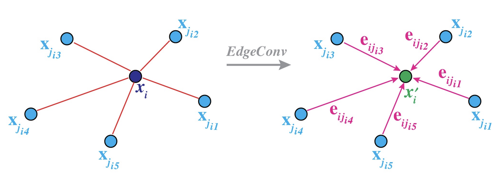
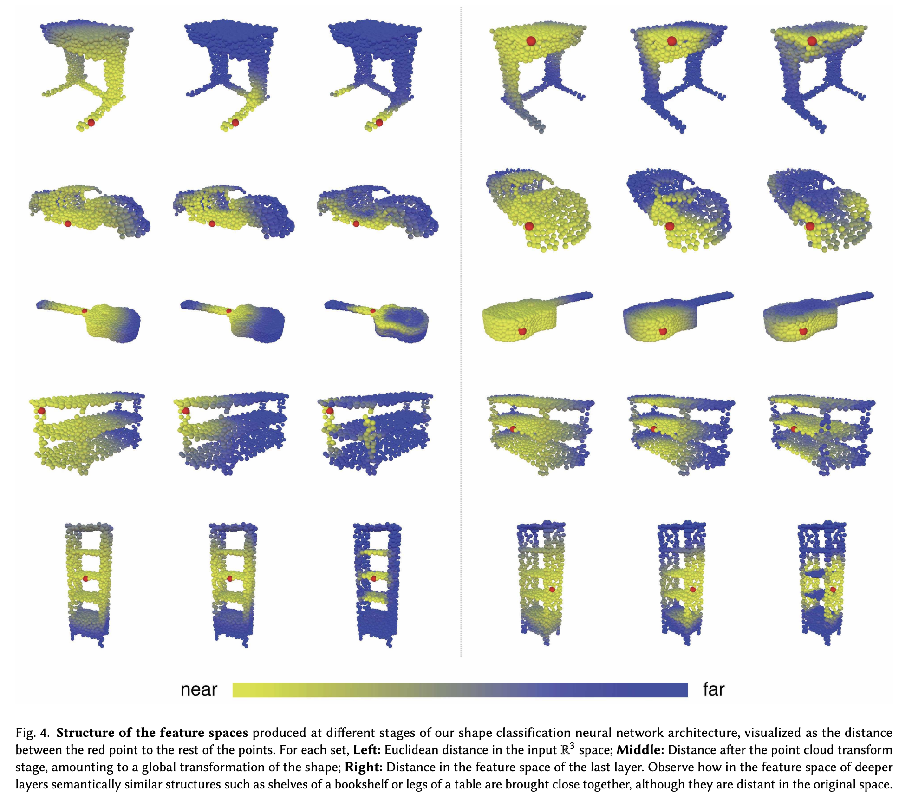
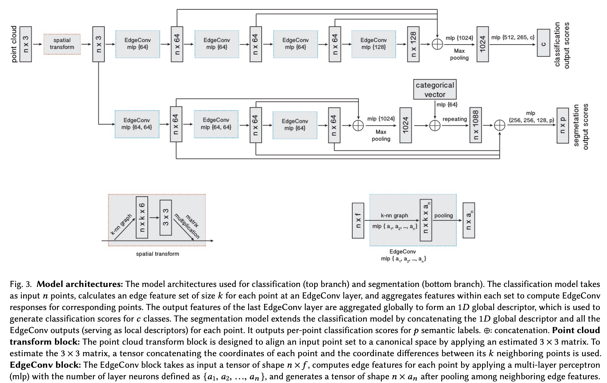

# 概要
点群は**トポロジー（接続関係）を持たない**ため、CNN の畳み込みをそのまま適用できないため各層で **k-NN により動的にグラフを構築**し、そのエッジ上で点群の表現を学習。グラフは**入力空間**だけでなく**特徴空間**に基づいて逐層再計算するため、高層では意味的に近い点同士が接続され、長距離の文脈を捉えられる。**微分可能**であり既存アーキテクチャに組み込める。

# 背景と動機

## 点群の性質
- **順序不変**: 点群は点の並び順に意味がなく、並べ替えても同じ形状を表す。CNN の畳み込みは近傍の上下左右などを仮定するため、不適。
- **トポロジー欠如**: 点群には点同士の接続関係（エッジ・面）が与えられていない。画像はピクセル間の格子構造があるが、点群は 3D 空間に離散点が分布するだけであり、どの点を「近傍」とするかはモデルが決める必要がある。
- そのため、点群に CNN 的処理を適用するには**局所構造を何らかの形で定義**し、その上で特徴を集約する設計が求められる。

## PointNet・PointNet++ などの先行研究との対比

- **PointNet**: 各点を独立に MLP で処理し、グローバル max pooling で全体の表現を得る。順序不変で効率的だが、**局所構造を明示的には扱わない**。したがって、近傍同士の相対関係（エッジ情報）を学習に活用しづらい。
- **PointNet++**: 階層的に点群をサンプリングし、各局所領域で mini-PointNet を適用する。局所性は導入されるが、近傍は**入力空間（座標）での距離**に基づいて固定され、**層を重ねてもグラフは変わらない**。
- **DGCNN の位置づけ**: 局所構造を**エッジ（点対）**として明示的に扱い、かつ**層ごとに特徴空間で k-NN を再計算**することで、高層では意味的に近い点同士が接続される。PointNet++ の「局所集約」を、動的に更新されるグラフ上でのエッジ畳み込みに拡張した形となる。

# EdgeConv

## エッジ特徴の数式

点 $i$ の近傍 $\mathcal{N}(i)$（k-NN で定まる）に対して、エッジ $(i, j)$ の特徴を
$$ e_{ij} = h_\Theta(\mathbf{x}_i, \mathbf{x}_j) $$
とする。論文では
$$ h_\Theta(\mathbf{x}_i, \mathbf{x}_j) = \bar{h}_\Theta(\mathbf{x}_i, \mathbf{x}_j - \mathbf{x}_i) $$
を採用する。$\mathbf{x}_i$ は点 $i$ の特徴（中心点の**グローバル**情報）、$\mathbf{x}_j - \mathbf{x}_i$ は相対ベクトル（近傍 $j$ の**ローカル**情報）であり、両方を入力することで局所幾何と中心の文脈を同時に扱う。

**実装**：$\bar{h}_\Theta$ は MLP で、入力は $\mathbf{x}_i$ と $\mathbf{x}_j - \mathbf{x}_i$ の連結、または線形結合
$$ e_{ij} = \mathrm{ReLU}\bigl( \Theta(\mathbf{x}_j - \mathbf{x}_i) + \Phi(\mathbf{x}_i) \bigr) $$
とする（$\Theta, \Phi$ は学習可能な線形層）。

## 集約（max pooling）の役割

点 $i$ の更新特徴は、近傍のエッジ特徴を**対称関数**で集約して
$$ \mathbf{x}'_i = \square_{j \in \mathcal{N}(i)} \, e_{ij} $$
とする。$\square$ は sum や max など、近傍の順序に依存しない関数。論文では **max** を用いる。

**max の性質**：近傍の順序不変（permutation invariant）であり、かつ「最も強い」エッジ特徴を選ぶため、 salient な局所パターンを保持しやすい。PointNet のグローバル max pooling と同様の役割を、局所グラフ上で行っている。

## PointNet の local descriptor との関係

論文で挙げられる edge 関数の比較：
- $h(\mathbf{x}_i, \mathbf{x}_j) = \mathbf{x}_j$：近傍の特徴をそのまま集約。中心 $\mathbf{x}_i$ の情報が使われない。
- $h(\mathbf{x}_i, \mathbf{x}_j) = \mathbf{x}_i$：中心のみ。集約後も点ごとに独立で、**PointNet と同等**（局所構造を活かさない）。
- $h(\mathbf{x}_i, \mathbf{x}_j) = \bar{h}(\mathbf{x}_i, \mathbf{x}_j - \mathbf{x}_i)$（DGCNN）：中心と相対ベクトルの両方を使い、**エッジとしての関係**を明示的に学習する。PointNet の「点ごと独立」を超えて、点対の幾何を扱える。

# 動的グラフの構築

DGCNNではグラフ構造を層ごとに作り直す。各層で EdgeConv を適用したあと、得られた**特徴**を使って k-NN をやり直し、次の層の近傍関係とする。

## 各層での k-NN グラフの再計算

各層の**出力特徴**（その層の EdgeConv で更新された点の表現）を入力として、全点対の距離を計算し、各点について距離が小さい順に k 個を近傍とする。その k-NN グラフの上で次の層の EdgeConv が作用する。つまり「誰が誰の近傍か」は層ごとに**再計算**され、ネットワークを通して変わっていく。実装では、Forward のたびにその層の特徴テンソルに対して k-NN（または ball query）を実行するだけなので、微分可能であり end-to-end で学習できる。

**定式化**
層 $l$ の点の特徴を $\mathbf{x}_i^{(l)}$ とすると、その層で使う近傍は
$$ \mathcal{N}^{(l)}(i) = \left\{ j \mid \|\mathbf{x}_i^{(l)} - \mathbf{x}_j^{(l)}\| \text{ が } j \neq i \text{ のうち小さい方から } k \text{ 番目以内} \right\} $$
（ユークリッド距離で k-NN）。この $\mathcal{N}^{(l)}(i)$ の上で EdgeConv を適用し
$$ \mathbf{x}_i^{(l+1)} = \square_{j \in \mathcal{N}^{(l)}(i)} \, h_\Theta\bigl(\mathbf{x}_i^{(l)}, \mathbf{x}_j^{(l)}\bigr) $$
を得る。次の層では $\mathbf{x}^{(l+1)}$ に基づいて新たに $\mathcal{N}^{(l+1)}(i)$ を計算するため、近傍集合が層ごとに変わる。