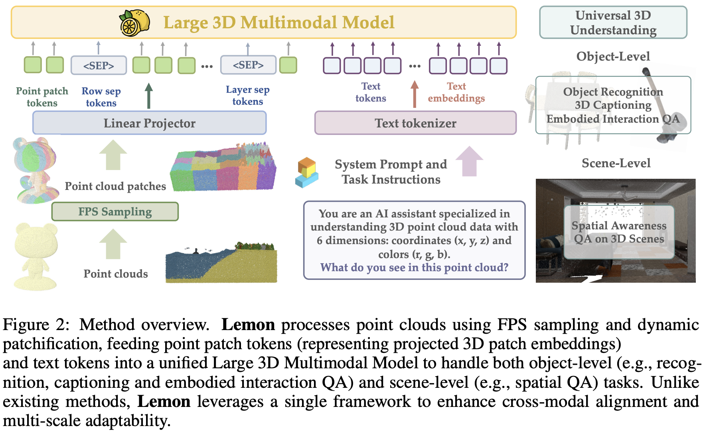

# 概要

**3D 点群と言語を一つの Transformer で扱う**、統一型 3D 大規模マルチモーダルモデル（3D LMM）。従来の 3D LMM が「3D エンコーダ + 言語モデル + クロスモーダル整列」という**モダリティ別モジュール**に依存していたのに対し、Lemon は **点群パッチとテキストトークンを単一シーケンスとして連結**し、**モダリティ専用エンコーダを廃止**して early な空間–言語融合とパラメータ効率・スケーラビリティの改善を狙う。

- **統一アーキテクチャ**: 点群を **階層的 3D 分割（Z→Y→X の順）** でパッチ化し、各パッチを学習可能な線形プロジェクタで LLM の埋め込み空間に写す。3D 用の特殊トークン（点群シーケンスの境界・パッチ区切り・空間階層用セパレータ）で構造を保ち、テキストトークンと連結した **一つのシーケンス** を単一 Transformer（Qwen2.5-7B-Instruct ベース）に入力する。これにより、別途 3D エンコーダ（例: PointNet++）を置かずに 3D と言語を end-to-end で学習する。

- **動的パッチ化**: 点群の分布に応じて軸ごとの分割数を適応的に決め、パッチあたり点数を一定（論文では $M=512$、軸あたり最大分割 $K=5$）に近づける。空間的な文脈を保ったトークン列を得るための **structured patchification and tokenization** として提案されている。

- **3 段階訓練カリキュラム**: (1) **物体認識** — Objaverse や ScanNet 等から抽出した大規模 3D 物体データ（約 1.87M 点群–ラベルペア）で分類；(2) **物体キャプション・グラウンディング** — Cap3D・GAPartNet（約 140K）で記述と grounding；(3) **シーン空間 QA** — 3D-GRAND 等（約 142K QA、50K シーン）でシーン級の空間関係質問に回答。物体レベルからシーン推論へ段階的に能力を積み上げる。

**結果**: 3D MM-Vet（embodied 物体 QA）、3D-GRAND（シーン空間 QA）、Objaverse-LVIS（物体認識）、物体キャプションの各タスクで **3D LMM の SOTA**。PointLLM・ShapeLLM・3D-LLM・Ll3da・LEO・LSceneLLM を上回り、単一視点 2D 入力の GPT-4V と同等以上になるタスクもある。Ablation では **PointNet++ を前置するとかえって性能が落ちる**ことを示し、統一設計で 3D エンコーダが不要であることを支持。さらに **3D LMM では初のスケーリング則**（データ量・モデルサイズ増加に伴う性能向上）を報告している。

# 記入中
記入中
