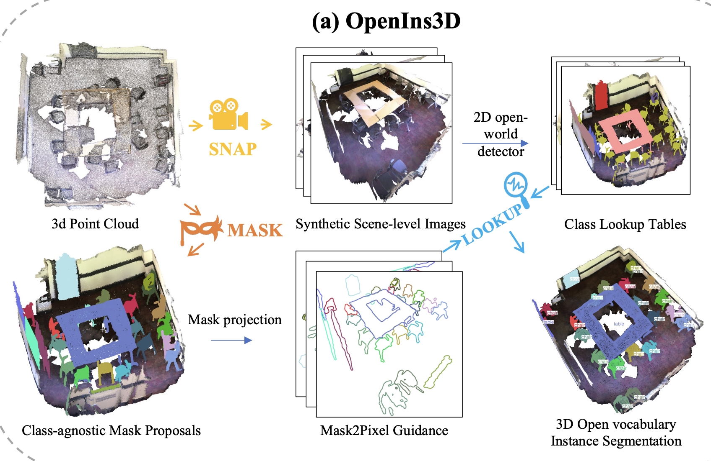
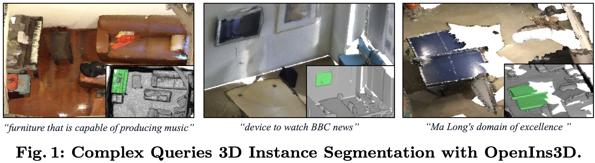

# 概要

**3D のみを入力**とする 3D オープン（未知のインスタンスに対応可）語彙シーン理解のフレームワーク。整列した 2D 画像を必要とせず、訓練済み 2D の Vision-Language モデル（VLM）を **Mask-Snap-Lookup** の 3 段階で組み込む。「クラス非依存の 3D マスク提案 → 合成画像で 2D VLM に問い合わせ → マスクにカテゴリ名を付与」により、認識・物体検出・インスタンス分割で室内・室外の複数データセットで SOTA を報告している。

- **Mask**: 3D 点群から **クラス非依存のマスク提案** を学習。何であるかは問わずインスタンス候補を出す。
- **Snap**: 複数スケールで **シーン級の合成画像** を生成し、2D VLM で「興味ある物体」を検出・ラベル付けする。3D を 2D に写して既存の 2D オープン語彙能力を利用する。
- **Lookup**: **Mask2Pixel** など 3D マスクと合成画像の対応を利用し、Snap の 2D 検出・ラベルを **検索** して各 3D マスクにカテゴリ名を割り当てる。

**2D 検出器の差し替えに再訓練は不要**で、強力な 2D オープンワールドモデルや LLM 連携 2D モデルと組み合わせることで、複雑なテキストクエリや推論・実世界知識を要する質問にも対応できるとしている。

プロジェクトページ: [OpenIns3D](https://zheninghuang.github.io/OpenIns3D/)

---

# 背景と動機

## 3D オープン語彙と「2D 画像なし」の制約

3D–テキストデータセットの構築は難しく、現実的には **2D 画像を介して**言語と 3D をつなぐアプローチが主流になっている。代表が **OpenScene**（2D 特徴の 3D への distillation）、**PLA 系**（2D キャプションで 3D–テキストペアを構築）、**CLIP2Scene** など。いずれも **整列した（well aligned, 幾何的に関係づけられた） 2D 画像と 3D 点群**が前提。そこでモデルを3D のみを入力とする形で設計する。

## Mask-Snap-Lookup のアイデア（3D のみ入力で 2D VLM を利用）

3D から **合成画像** を生成し、その画像を 2D VLM に入力して「何がどこにあるか」を得て、 **3D マスク提案（Proposal）** と対応づける、という 3 段階（Mask–Snap–Lookup）を採用する。

- **Mask**: 3D 点群から **クラス非依存のマスク提案** を出す。何であるかは問わずインスタンス候補を列挙する。整列 2D は不要。
- **Snap**: 複数スケール・複数視点で **シーン級の合成画像** をレンダリングし、2D オープン語彙検出器に入力して、検出された物体のカテゴリとピクセル位置を **Class Lookup Table (CLT)** に格納する。3D を 2D に写して既存の 2D VLM に問い合わせる。
- **Lookup**: **Mask2Pixel** で各 3D マスクを合成画像上のどのピクセル領域に対応するか把握し、CLT を **検索** して各マスクにカテゴリ名を割り当てる。複数視点の結果を統合し、未割り当てのマスクには Local Enforced Lookup で局所的に再度 2D 検出を行う。

このように「3D → 合成 2D → 2D VLM → 検索で 3D に戻す」ことで、**aligned 2D 画像なし**で 2D VLM の能力を 3D インスタンス単位に転用している。
---

# 手法
---

## 全体の流れ（Mask → Snap → Lookup）

1. **Mask**: 点群を **MPM (Mask Proposal Module)** に入れ、クラス非依存の 3D マスク提案と **mask score**（各マスクの品質予測）を得る。マスクは点の数次元の0~1のベクトル。
2. **Snap**: Snap モジュールで **N 枚のシーン級合成画像** をレンダリングし、2D オープン語彙検出器（テキストクエリ付き）に入力。検出結果（物体のカテゴリとピクセル位置）を **Class Lookup Table (CLT)** に格納する。
3. **Lookup**: マスク提案と CLT を **Lookup** に渡す。まず **Mask2Pixel Guided Lookup (MGL)** でグローバルにカテゴリを割り当て、続いて **Local Enforced Lookup (LEL)** で未割り当てマスクを局所的に再検出。最後に **最終マスクフィルタ** でカテゴリが付かなかったマスクを除去し、結果を出す。

---

## Mask（クラス非依存 3D マスク提案）

**入力**: **3D 点群**（色付きの 3D データのみを使用。）

**モデル**: Mask3Dベースのモデル。 **Transformer ベース**の 3D インスタンスセグメンテーションで、(1) **点群用バックボーン**（スパース畳み込みなど）で**複数スケールの点特徴**を抽出し、(2) **学習可能な instance query** を Transformer decoder で点特徴に **attention** させ、(3) 各 query と点特徴から**各点がそのインスタンスに属するか**のスコア（soft mask）を並列に予測する。元の Mask3D はこのあと**マスクごとのクラス logit** で分類し、その logit で提案を絞るが、OpenIns3D では**クラス分類まわりをすべて削除**し、マスク提案とその品質スコアだけを出す **MPM** にしている。学習時はクラスラベルは使わず、Bipartite Matching で GT マスクと対応づけ、マスクの IoU のみを教師にする。

- **Mask Scoring**: マスクモジュールが出す instance query を浅い MLP に入れ、各マスクの **IoU（品質）** を予測する。教師は Bipartite Matching でマッチした GT マスクとの IoU、マッチしなかった提案は 0。L2 損失で学習し、未マッチの損失には重み $\gamma$ をかけて過度に IoU を下げないようにする。

- **Mask Filtering**: 品質向上のため 3 段のフィルタをかける。(1) **Intersection over Union（IoU） 閾値** $\beta$ 以上のみ残す。(2) **安定性フィルタ**（Segment Anything Model；SAM に着想）：同じ soft mask を閾値 $\pm\alpha$ で二値化した 2 つのマスクの IoU が 80% 超のマスクだけ残す（境界がはっきりしているマスクを選ぶ）。(3) **点数フィルタ**：点数が $N_{\min}$ 未満のマスクは無効として除去する。これで提案数が減り、後段の Snap/Lookup が扱いやすくなる。

---

## Snap（合成画像生成と 2D VLM による検出・ラベル）

マスクごとにレンダリングすると枚数が膨れ、時間もかかるため、**複数スケールのシーン級画像** を少数枚レンダリングし、その画像を 2D オープン語彙検出器にまとめて渡す。

- **カメラポーズ**: **3 スケール**で撮影する。(1) **Global**: シーン上空から中心を向く。(2) **Corner**: 上空の中心からコーナーを向く。(3) **Wide-angle**: 3×3 グリッドの交点にカメラを置き、最も遠いコーナーを向く。カメラ位置・注視点・上方向ベクトルから **Lookat** でポーズ行列を決める。
- **カメラ内部パラメータの較正**: 外部パラメータを決めたあと、**焦点距離・主点** をスケーリングして、シーン（またはその一部）が画像内に収まるようにする。投影範囲を画像座標の所望の範囲（例: [0, 1000]）に合わせ、アスペクト比は保つ。これで「興味領域を無駄なく写した」画像が得られ、2D VLM が理解しやすくなる。
- **Class Lookup Table (CLT)**: N 枚の合成画像を 2D オープン語彙検出器に入れ、興味クラスをテキストクエリで指定して検出する。検出された物体の **カテゴリとピクセル位置** を CLT に格納する。後段の Lookup でこの表を参照して 3D マスクにカテゴリを付ける。

実装では 1000×1000 の画像を、global 16 枚・corner 4 枚・wide-angle 4 枚などで取得している。

---

## Lookup（マスクとカテゴリの対応づけ・Mask2Pixel）

**Mask2Pixel**: Snap で使ったのと**同じカメラの外部・内部行列**で、各 3D マスクを 2D 画像上に投影し、「どのマスクがどの画像のどのピクセル領域に写っているか」の対応（Mask2Pixel map）を用意する。

- **Mask2Pixel Guided Lookup (MGL)**: 各 3D マスクの 2D 投影と、CLT に載っている 2D 検出ボックスとの **IoU** を計算し、最も IoU が高い検出のカテゴリをそのマスクの候補とする。IoU が 20% 未満のマッチは無視。**複数視点**の結果を統合し、正規化した平均 IoU でスコア化して最終的なカテゴリを決める。occlusion は深度を考慮した投影で扱う。
- **Local Enforced Lookup (LEL)**: MGL のあともカテゴリが付かないマスクがあるため、**残りのマスク**について、シーン画像からそのマスク周辺を**拡大した bbox でクロップ**し、そのクロップを再度 2D 検出器に入れて検出を促す。どの視点でクロップするかは **Occlusion Report** で各マスク・各視点の遮蔽状況を評価し、上位 K 視点を選ぶ。
- **最終マスクフィルタ**: MGL と LEL のあともカテゴリが付かなかったマスク提案は**捨てる**。これでオープン語彙インスタンスセグメンテーションの結果が得られる。

# 実験と結果

## データセットと評価設定（理解のための詳細）

OpenIns3D は **5 データセット** で評価している。いずれも **3D 点群（色付き）のみ** を入力とし、**2D 画像・カメラ pose・深度は一切使わない**。類似研究でデータを参照する際に重要な点をまとめる。

| データセット | 種別 | 元データの由来 | シーン・規模の目安 | セマンティッククラス数（論文での扱い） | 評価スプリット・除外クラス等 |
|-------------|------|----------------|--------------------|----------------------------------------|------------------------------|
| **S3DIS** | 室内 | RGB-D 由来の点群 | 6 エリア、各エリア複数部屋（会議室・オフィス・廊下等） | 元は 13 クラス（ceiling, floor, wall, beam, column, window, door, chair, table, bookcase, sofa, board, **clutter**）。**clutter は除外**→ 実質 12 クラス | 多くの work で Area 5 を validation。OVIS では PLA 族の **Base/Novel 分割**（8/4、6/6、12 クラス全 novel 等）に合わせて novel のみで AP50/AP25 を報告 |
| **ScanNetv2** | 室内 | RGB-D 動画から再構成した 3D | 1,500 以上スキャン、約 250 万ビュー（元 ScanNet） | 元は 20 クラス（NYU ラベルセット）。**「other furniture」を除外**→ 評価では 18 クラス等 | 認識は Top-1 インスタンス分類。OVIS は PLA の 10/7、8/9、17 クラス novel 等の分割で novel のみ報告 |
| **ScanNet200** | 室内 | ScanNet と同じ RGB-D シーン、語彙を拡張 | ScanNet と同じシーン、200 クラスへの細かいセマンティック注釈 | **200 クラス**（細粒度・ロングテール）。head / common / tail に分けて AP を報告 | OpenMask3D の設定に従う。MPM は Replica 用に **ScanNet200 で学習**したものを流用する設定もある |
| **Replica** | 室内 | フォトリアルな 3D 室内シーン再構成 | シーン数は数十規模（メッシュ＋テクスチャ） | インスタンスセグ用のクラス定義に従う | OpenMask3D の設定。**Replica のマスク提案は ScanNet200 で学習した MPM** の後、OpenMask3D の手順に従うと論文で言及 |
| **STPLS3D** | 屋外 | **航空写真測量**で構築した点群 | 大規模屋外シーン。**50 m × 50 m パッチ**に分割して評価（Mask3D に合わせる） | 植被を **low/medium/high vegetation → 1 つの「vegetation」に統合**、それ以外はそのまま | 3D のみ入力のベースライン（PointCLIP, PointCLIPV2）と比較。カメラは 10 m 上げる等の設定 |

**入力の共通前提**: 全データセットで **点の RGB は使用**するが、画像フレーム・深度マップ・カメラパラメータは**使わない**。これが「2D 入力なし」の条件である。

**MPM の学習**: S3DIS, ScanNetv2, ScanNet200, STPLS3D では **カテゴリラベルを使わず** MPM のみ学習（マスクの IoU のみ教師）。λ = 0.1 で zero-IoU の重みを下げる。Replica では ScanNet200 で学習した MPM を OpenMask3D の手順に従って用いる。

**Snap の設定**: 画像サイズ 1000×1000。global 16 枚・corner 4 枚・wide-angle 4 枚。S3DIS は天井が閉じているためシーンの**上端 0.5 m を除去**。STPLS3D は 50 m×50 m パッチ、カメラ高さ 10 m。

---

## 2D 検出器の差し替えと LLM 連携
メインの定量的実験では **Grounding DINO (G-DINO)** と **ODISE** を差し替え可能なオープン語彙検出器として使い、LLM 連携の**追加オプション**として **LISA** を組み合わせている。

- **検出器の差し替え**: Snap で使う **2D オープン語彙検出器は再学習なしで差し替え可能**。Table 7 では **G-DINO** と **ODISE** でレンダリング・推論時間と AP25 を比較（8 枚で 8.5 s / 10.5 s、AP25 29.8 / 35.1）。2D 側が進化すれば、そのまま 3D パイプラインに載せて能力を伸ばせる。

- **LLM 連携**: **LISA**（LLM 駆動の推論セグメンテーション）を 2D 検出器として組み合わせると、**複雑なテキストクエリ**（推論や実世界知識を要する質問）にも 3D で答えられる。

# 限界と今後の課題

- **GT マスクへの依存**: SAM と同様、OpenIns3D の MPM は **ground truth インスタンスマスク**で教師されている。未知のマスクへの汎化は示しているが、クラス非依存のマスクを大量に得る別経路（**UnScene3D**、**Segment3D** など教師なし・弱教師のマスク提案）と Snap/Lookup を組み合わせる検討は今後の課題としている。

- **セマンティックセグメンテーションとのトレードオフ**: マスク品質を上げるため**フィルタで低品質提案を捨てる**設計のため、インスタンス分割では偽陽性が減る一方、**セマンティックセグメンテーション**では全ピクセルをラベル付けするタスクと相性が悪い。OpenScene と同条件の 4 クラスで mIoU を比較した Table 19 では、OpenIns3D は OpenScene より劣る結果となっている。

- **小物体・再構成の悪い物体**: 性能は**点群の質**に強く依存する。**非常に小さいマスク**や**点がまばらなマスク**は、レンダリング後も画像上で占めるピクセルが少ない、あるいは断片的で 2D 検出器に認識されにくい。ScanNet200 では common・tail クラスでこうした限界が顕著で、本文でも「3D で十分に再構成されていない小物体」に限界があると述べている。STPLS3D では自転車・バイク・看板・街灯など非常に小さい物体で弱く、Snap のカメラを高所に置くためこれらの物体が画像上で小さくなることが理由として挙げられている。

**今後の方向**: 上記に加え、2D 検出器の差し替えが再訓練なしで可能なため、2D の進化に合わせて 3D パイプラインを伸ばせること、およびレンダリング手法の試行（マスク単位・メッシュ・シーン級など）を詳細に記録し今後の参照に供することが述べられている。

# MEMO
点群の表現はhttps://arxiv.org/pdf/2210.03105 で獲得している