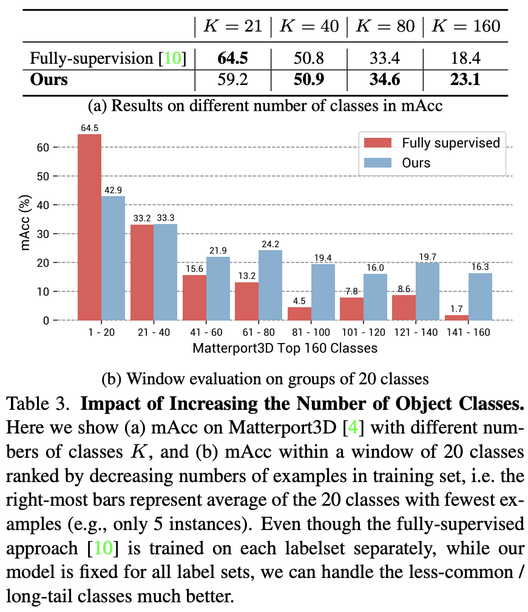
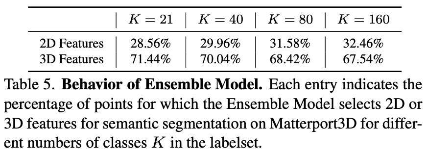

# 概要

3D シーンの各点に **CLIP の特徴空間と co-embed された密な特徴** を予測し、**ラベル付き 3D データなし**でオープン語彙のシーン理解を実現する。

- **アプローチ**: 3D 点ごとに、テキスト・画像と同一の CLIP 特徴空間に載る特徴を推論する。タスク非依存で学習し、**ゼロショット**で任意の語彙に汎化する。
- **セマンティック分割**: 全 3D 点の CLIP 特徴を推論したあと、任意のクラス名の埋め込みとの類似度で分類する。従来の教師あり 3D セグメンテーションを上回るゼロショット性能を報告。
- **オープン語彙クエリ**: ユーザーが任意のテキストクエリを入力すると、シーンのどの部分がそれに一致するかを **ヒートマップ** で表示するなど、物体・素材・アフォーダンス・活動・部屋タイプなど多様なクエリに 1 モデルで対応する。
- **学習**: **ラベル付き 3D データは使わない**。CLIP 空間への写像を 2D–3D の対応などで学習し、オープン語彙の質問に答える単一モデルを実現している。

プロジェクトページ: [OpenScene](https://pengsongyou.github.io/openscene)

---

# 背景と動機

---

## 従来の 3D シーン理解の限界（閉集合・教師あり）

- 3D シーン理解では各点の**セマンティクス・アフォーダンス（そこでで何をできるか、ex.寝れる→ベッド）・素材・部屋タイプ・物理属性**などを推論したいが、従来手法は**ベンチマーク用の閉じたクラス集合**（例: ScanNet の 20 クラス）で教師あり学習する設計が多い。そのため「椅子・テーブル・ベッドのどれか」といった**1 種類の質問**には答えられても、**レアな物体**のセグメンテーションや、**3D 教師が存在しない質問**（素材推定など）には対応しづらい。

- 2D のラベルのみで 3D を学習する研究はいずれも**小さい固定ラベルセット**が前提で、クラス数が増えると性能が落ちる。

---

## CLIP を 3D に持ち込むアイデア

- **CLIP** はキャプション付き画像で学習し、**テキストと画像を同一の特徴空間**に写像するモデル。この空間は物体名だけでなく、素材・属性・機能・アフォーダンスなども表現できる。OpenScene は、**3D 点の密な特徴をこの CLIP 空間に載せ**て表現ベクトルの**類似度**で、オープン語彙のセグメンテーション・検索・ヒートマップを実現する。

- そのために、**3D 点と posed 画像のピクセルを対応づけ**、既存のオープン語彙 2D セグメンテーション（LSeg, OpenSeg）のピクセル特徴を 3D に集約し、それを**擬似教師**として 3D ネットを学習する。ラベル付き 3D は一切使わず、CLIP と同空間に載った 3D 特徴を獲得し、単一モデルで多様なクエリに答える設計とする。

---

# 手法

---

## 全体の流れ（2D fusion → 3D distillation → 2D-3D ensemble）

入力は **3D メッシュまたは点群** と **posed RGB 画像**。  
- (1) 各画像からオープン語彙 2D セグメンテーション用の**ピクセル単位の特徴**を抽出し、複数視点から各 3D 点へ集約して **2D fused feature**（2Dと融合した特徴） $F^{2D}$ を得る（Image Feature Fusion）。  
- (2) 3D 点群のみを入力とする 3D ネットを、$F^{2D}$ に一致するように学習し、**3D distilled feature**（蒸留した特徴） $F^{3D}$ を出力させる。  
- (3) 推論時、各点の $f^{2D}$ と $f^{3D}$ を、クエリ（テキストプロンプト）との類似度に基づいて選び、**2D-3D ensemble feature** $f^{2D3D}$ を構成する。  
- (4) 任意のテキスト（または画像）の CLIP 埋め込みとの **cosine similarity** で、セグメンテーション・検索・ヒートマップなどを行う。

---

## Image Feature Fusion（2D 特徴の抽出と 3D への投影・融合）

- **Image Feature Extraction**: 各 RGB 画像を、**凍結した（frozen, パラメータを固定したモデル）**オープン語彙 2D セグメンテーション用モデル $E^{2D}$（OpenSeg または LSeg）に入力し、ピクセルごとの埋め込み $I_i \in \mathbb{R}^{H \times W \times C}$ を得る。
- **2D-3D Pairing**: シーンの 3D 点 $p$ について、各フレーム $i$ のカメラの内部行列・外部行列から **pinhole モデル**で投影し、対応するピクセル $u = (u,v)$ を求める。ScanNet や Matterport3D のように深度がある場合は **occlusion test** を行い、見えている表面の点だけをペアにする。
- **Fusing Per-Pixel Features**: 点 $p$ が $K$ 枚の画像に写っているとき、各フレームでの特徴 $f_i = I_i(u)$ を **average pooling** でまとめ、$f^{2D} = \phi(f_1, \ldots, f_K)$ とする。全点について行い、特徴点群 $F^{2D} = \{f_1^{2D}, \ldots, f_M^{2D}\}$ を構築する。
---

## 3D Distillation（3D ネットで 2D 融合特徴を再現）

$F^{2D}$ は画像があるときそのまま使えるが、**2D 予測のぶれ**でノイジーになりやすく、また**画像がない**（点群のみ）設定にも対応したい。そこで、**3D 点の座標だけ**を入力とする encoder $E^{3D}$ を用意し、その出力 $F^{3D} = E^{3D}(P)$ が $F^{2D}$ に近づくように学習する（**distillation**：2D の visual–language の知識を 3D ネットに移す）。

- **Loss**: 対応点の $f^{3D}$ と $f^{2D}$ の **cosine similarity** を最大化。
- **Backbone**: $E^{3D}$ は MinkowskiNet18A を用い、出力次元を $C$（CLIP 特徴次元）に合わせる。OpenSeg/LSeg の特徴は CLIP と co-embed されているため、$F^{3D}$ も CLIP 空間に載り、画像がなくても任意のテキストプロンプトで 3D シーン理解ができる。

### MinkowskiNet18A

**スパース 3D 畳み込み**による CNN。**Minkowski Engine**（NVIDIA 等）上で、点群やボクセルを「活性サイトだけ」に対して畳み込みするため、密な 3D 畳み込みより計算・メモリが軽いモデル。3D セマンティックセグメンテーション（ScanNet など）でよく使われる backbone。**18** は層の深さ（ResNet-18 と同様の命名）、**A** はそのアーキテクチャバリアントを指す。

---

## 2D-3D Feature Ensemble（クエリに応じた 2D/3D の選択）

$f^{2D}$ は**小さい物体**や**幾何が曖昧なもの**（壁の絵など）に強く、$f^{3D}$ は**形がはっきりしたもの**（壁・床など）に強い。この両方の良さを合わせるため **ensemble** を行う。

- **手順**: 推論時に（またはオフラインで）テキストプロンプトの集合（例: ベンチマークのクラス名、ユーザー定義の任意クラス）を決め、CLIP のテキスト encoder で埋め込み $T = \{t_1, \ldots, t_N\}$ を得る。各 3D 点について $f^{2D}$ と $f^{3D}$ と各 $t_n$ の **cosine similarity** $s_n^{2D}$, $s_n^{3D}$ を計算し、$s^{2D} = \max_n s_n^{2D}$、$s^{3D} = \max_n s_n^{3D}$ をその点の「2D スコア」「3D スコア」とする。**最終的な ensemble 特徴** $f^{2D3D}$ は、$s^{2D}$ と $s^{3D}$ の**大きい方**に対応する特徴（$f^{2D}$ または $f^{3D}$）をその点の代表とする。

---

# 実験と結果

**データセット**: ScanNet（室内 RGB-D + メッシュ）、Matterport3D（室内）、nuScenes Lidarseg（屋外 LiDAR）の 3 つで評価。室内 2 つは posed RGB 画像と 3D が与えられ、屋外は LiDAR 点群。

| 項目 | ScanNet | Matterport3D | nuScenes Lidarseg |
|------|---------|---------------|-------------------|
| シーン・入力 | 室内 RGB-D + 3D メッシュ | 室内 RGB-D、建物スケール | 屋外 LiDAR スキャン |
| セマンティッククラス数（論文で評価） | 20 クラス（NYU ラベルセット）。4 クラス unseen 比較時は 4 | ベンチマーク K=21／NYU ラベルで K=40, 80, 160 も使用 | ベンチマークのクラス数で評価 |
| 評価スプリット（論文） | validation set | test set | validation set |
| 論文で言及されている規模など | 20 クラス中 4 クラスで 3DGenZ 比較 | test set: 18 buildings、406 indoor/outdoor regions（オープン語彙検索の記述）。約 90 建物・約 1 万パノラマビュー（データセット全体の一般的な説明） | 自動運転シーン、LiDAR 点群 |
| 備考 | occlusion test で可視点のみ 2D-3D 対応 | 多様で教師ありが難しいと論文で言及。ロングテール実験は K クラスで実施 | 室内 2 つと異なり LiDAR のみの設定 |

※ クラス数・スプリットは論文の実験設定。シーン数等の詳細は各データセットの公式ベンチマークに依存。

---

## ゼロショット 3D セマンティックセグメンテーション

- **4 クラス unseen 設定（ScanNet）**: ベースラインとして、3DGenZを 20 クラス中 16 を「見た」クラスとして教師あり学習し、残り 4 クラス（bookshelf, desk, sofa, toilet）でゼロショット評価。OpenScene は**いずれのクラスにも 3D/2D ラベルで学習していない**が、mIoU 62.8%（LSeg）/ 51.2%（OpenSeg）で大きく上回る。理由の一つは、OpenScene が CLIP 特徴を回帰してから分類するためクラス間の類似・相違を自然に扱えるのに対し、MSeg Voting は「分類してから投票」で全クラスを等価に扱うこと（ソファとラブシートがソファと飛行機と同じくらい「違う」とみなされる）。
- **全クラス・3 データセット（Table 2）**: ゼロショット比較では MSeg Voting を nuScenes / ScanNet / Matterport3D のいずれでも mIoU・mAcc で上回る。教師あり SOTA（MinkowskiNet 等）とは差があるが、数年前の教師あり手法 [13, 25, 50] と同程度。Matterport3D では SOTA との差が最も小さい（mIoU -11.6、mAcc -8.0）。定性では、GT の誤り・曖昧さで「不正解」とされた予測が実際には正しい例もある（壁の絵のセグメント、nuScenes のトレーラー付きトラックなど）。

---

## クラス数増加時の比較（ロングテール・教師あり超え）

Matterport3D で、**出現頻度の高い順に K クラス**（K = 21, 40, 80, 160）だけをラベルセットにした設定で比較。教師ありベースラインは **K ごとに別の MinkowskiNet を学習**、OpenScene は **1 モデルのまま**（クラス非依存）。

- **Table 3 (a)**: K=21 では教師ありが有利（64.5 mAcc vs 59.2）。K が 40・80・160 と増えると OpenScene が逆転（K=160 で 23.1 vs 18.4）。クラス数が増えるほど教師ありは尾のクラスで弱くなる。
- **Table 3 (b)**: クラスを出現頻度順に 20 個ずつの窓に分け、各窓の mAcc をプロット。教師ありは「最も少ない 20 クラス」で極端に低下（数例しかないクラス）。OpenScene は 3D ラベルに依存しないためロングテールに強く、同じ 1 モデルで全 K に対応できる。

---

## Ablation（2D 特徴源・2D-3D ensemble の有効性）

- **2D 特徴源（OpenSeg vs LSeg）**: 両方で実験し、多くの設定で **OpenSeg の方が精度・汎化が良い**（Table 1, 2, 4）。以降の実験は特記なき限り OpenSeg。

- **Ensemble の振る舞い**: セマンティックセグメンテーションで、各点に 2D と 3D のどちらの特徴が選ばれたかを Matterport3D で集計。**約 70% が 3D 特徴**で、3D distillation の寄与が大きい。一方、クラス数 K が増えるほど 2D が選ばれる割合が増える（K=21 で 28.56%、K=160 で 32.46%）。ロングテールのクラスは物体が小さい・事例が少ないことが多く、2D 特徴が効いていると解釈される。

# 限界と今後の課題

- **推論時の 2D 特徴の活用**: テスト時に画像がある場合、**より早い段階で 2D ピクセル特徴を融合**（early fusion）すれば、推論結果をさらに改善できる可能性を試したが目立った改善には至っていない。
- **評価タスクの広がり**: 実験の中心は**閉集合の 3D セマンティックセグメンテーション**であり、オープン語彙クエリ（物体検索・素材・アフォーダンス・活動など）は**定性的なデモ**にとどまっている。それらのタスクには 3D の ground truth があるベンチマークがほとんどないため、定量的な評価が難しい。今後の課題として、**ground truth が得にくいタスク**でもオープン語彙クエリの成功度を測れる実験デザインがある。