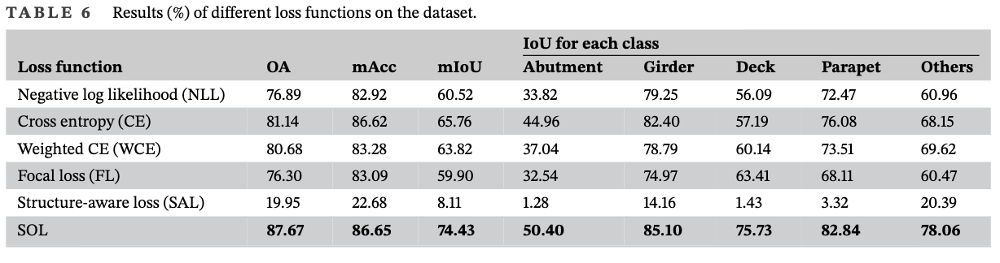

# 概要

**橋梁点群のセマンティックセグメンテーション（SS）** において、橋の構造に特有の**空間配置パターン**を学習に反映させる **Structure-Oriented Concept（SOC）** と、それを損失関数に落とし込んだ **Structure-Oriented Loss（SOL）** を提案した論文。従来の橋梁点群 SS では、他タスク用や汎用の損失（CE, WCE, Focal Loss 等）をそのまま使うことが多く、橋の「部材の水平方向の絶対位置」と「垂直方向の相対位置関係」といった**幾何的パターン**を明示的に扱う損失はなかった。SOL により、既存の SS モデルでも精度が大きく向上することを実験で示している。

- **SOC（Structure-Oriented Concept）**: 橋梁部材の空間分布を定式化する概念。**(1) 各部材の水平方向の絶対位置**（平面内での配置）と **(2) 他部材との垂直方向の相対位置**（上下関係）の両方を考慮し、「どのサンプル（点・領域）に学習の重点を置くか」を橋の幾何に基づいて決める。これにより、橋に特有の構造的規則性を損失計算に組み込む。

- **SOL（Structure-Oriented Loss）**: SOC に基づいて定義した損失関数。学習時に対象とする点群の空間分布パターンに沿って重み付けやペナルティを設け、既存の SS モデル（PointNet 系・RandLA-Net 等）の学習にそのまま組み替えて用いることを想定している。ハイパーパラメータは実験で較正。

- **比較実験**: 同一の橋梁点群データセット（日本国内の RC 橋 12 橋を terrestrial laser scanner で取得）上で、**NLL, CE, WCE（Han et al.）, Focal Loss, SAL（Structure-Aware Loss）** の 5 種類の損失と SOL を比較。SOL は **Overall Accuracy を 6.53%**、**mean IoU を 8.67%** それぞれ向上させた。とくに **「others」カテゴリの IoU が 8.44% 改善**しており、ノイズ点の除去（denoising）の自動化に重要だとしている。可視化結果でも SOL の優位性が示されている。

- **位置づけ**: 損失関数を橋梁点群の特性に合わせて設計する初の試みとして位置づけられ、SOC・SOL の頑健性と他 SS モデルへの転用可能性が議論されている。橋梁点群はスケールが大きくクラス不均衡もあり、既存研究はモデル構造・前処理・データ拡張などで対処してきたが、**損失関数**で構造情報を活かすアプローチは未開拓だったとしている。

# Structure-Oriented Concept（SOC）

## 目的

橋梁の構造に合う分布を作る。

## 水平分布（horizontal distribution）

各部材の**水平面内（XY）での位置**を表現する。多くの部材の水平投影は矩形で近似できるため、**各部材インスタンスを囲む最小外接矩形（minimum rectangle）** を学習前に GT から計算し、頂点座標を記録する。主桁・床版は 1 つずつ、橋台・欄干は左右ペアで 2 つずつ矩形を用意する。

- **判定「condition C」**: クラス $c$ について、モデルが「クラス $c$ である」と予測した点（またはそのクラス $c$ の予測点群の中心）の水平座標 $(x,y)$ が、**GT に基づくクラス $c$ の正しい矩形領域の外**にあるとき、condition C が True となる。つまり「水平方向で明らかにあり得ない場所にクラス $c$ と予測している」場合にペナルティの対象とする。

## 垂直分布（vertical distribution）

各部材の**垂直方向（Z）の相対関係**を利用する。橋全体または各スライシングウィンドウ内で、GT に基づくクラス $k$ の点群の**垂直中心** $z_{\mathrm{gt}}^k$ を計算する。典型的な順序は **abutment（橋台）→ girder（主桁）→ deck（床版）→ parapet（欄干）** の下から上である。

- **不確実性**: スキャン欠損やスライシングの切り出し方で、ウィンドウ内では「床版より主桁の Z 中心が上」のように**順序が逆転**することがある。このため、**「このウィンドウ内で垂直順序が GT と一致している部材ペア」だけ**を対象に、予測の上下逆転にペナルティをかける。
- **判定「condition(c, i)」**: クラス $c$ と $i$（$c < i$ の順で下から上）について、**GT では $i$ が $c$ より上**（$z_{\mathrm{gt}}^i > z_{\mathrm{gt}}^c$）なのに、**予測の中心では $i$ が $c$ より下**（$z_{\mathrm{pre}}^i < z_{\mathrm{pre}}^c$）になっているとき、condition(c,i) が True。つまり「垂直の上下関係を予測で逆転させている」場合にペナルティとする。
- **距離による重み**: 部材列（abutment–girder–deck–parapet）のなかで**隣接しないペア**（例: 橋台と欄干）で上下を逆転させる誤りは、隣接ペアより重大とみなす。インデックス差 $|c-i| = k$ が大きいほどペナルティを強くする（後述の $\alpha_{c,i} = k \cdot \alpha$）。

---

# Structure-Oriented Loss (SOL)

## 目的

SOC で定めた「水平で領域外のクラス」と「垂直で上下逆転したクラスペア」に**重み（ペナルティ）** を乗せた **重み付き交差エントロピー** により、橋の構造に合わない予測を強く減らす。既存の SS モデル（PointNet++ 等）の出力と GT ラベルから重み $w_c$ を算出し、その重みで CE を計算するだけなので**既存フレームワークにそのまま組み替え可能**である。

## 定義

**スライシングウィンドウごと**に損失を計算し、全ウィンドウの損失の和を総損失とする。クラス数 $M$、GT ラベルベクトル $y_c$、予測確率（または one-hot に近いベクトル）$p_c$ として、SOL は

$$
L = - \sum_{c=1}^{M} w_c \, y_c \log p_c
$$

とする（$y_c$, $p_c$ は点ごとのラベル・予測をクラス $c$ について集約した形で用いる、通常の重み付き CE と同じ）。**クラス重み** $w_c$ を

$$
w_c = 1 + \beta_c + \sum_{i=1,\,i\neq c}^{M} \alpha_{c,i}
$$

で定義する。$\beta_c$ は**水平方向の重み係数**、$\alpha_{c,i}$ は**垂直方向の重み係数**である。

### 水平重み $\beta_c$

$$
\beta_c = \begin{cases} \beta, & \text{condition C is True} \\ 0, & \text{otherwise} \end{cases}
$$

- **condition C**: クラス $c$ について、そのウィンドウ内の**予測**でクラス $c$ とされた点の代表（例: 予測クラス $c$ の点群の中心）の水平座標 $(x_{\mathrm{pre}}^c, y_{\mathrm{pre}}^c)$ が、**GT に基づくクラス $c$ の最小外接矩形の内側にない**ときに True。True のとき $w_c$ に $\beta$ を加算する。

### 垂直重み $\alpha_{c,i}$

クラスは 1,…,M を「下から上」の順（abutment=1, girder=2, deck=3, parapet=4, others は別扱い）で並べ、$|c-i|=k$ のとき

$$
\alpha_{c,i}\big|_{|c-i|=k} = \begin{cases} k \cdot \alpha, & \text{condition}(c,i) \text{ is True} \\ 0, & \text{otherwise} \end{cases}
$$

- **condition(c,i)**: GT ではクラス $i$ がクラス $c$ より上（$z_{\mathrm{gt}}^i > z_{\mathrm{gt}}^c$）なのに、予測の垂直中心では $z_{\mathrm{pre}}^i < z_{\mathrm{pre}}^c$ となっているとき True。True のとき $w_c$ と $w_i$ の両方に $k\cdot\alpha$ を加算する（$k=j-i$ で $j>i$ のペア $(i,j)$ として扱う場合、$w_i$, $w_j$ に $(j-i)\alpha$ を加える）。

# 実験

## データセット

- **取得**: 日本国内の **RC 橋 12 橋** を **terrestrial laser scanner（Matterport Pro3）** で計測。橋の規模に応じて 1 橋あたり最低 10 測点。仕様は動作範囲 0.5–100 m、精度 ±20 mm@10 m、水平 360°／垂直 295°、105 pts/s。
- **クラス**: 5 クラス — **abutment（橋台）**, **girder（主桁）**, **deck（床版）**, **parapet（欄干）**, **others**。手動アノテーション。橋 1–9 は福島県郊外、橋 10–12 は東京近郊。橋 4・8・9 は RC 桁下に鋼桁、他は RC 桁のみ。橋 5 は下面が計測不可で側面・上面のみ、橋 10–12 は欄干クラス不足を補うため欄干周辺のみ計測した不完全データ。
- **前処理**: 計算効率のため **ランダムダウンサンプリングで 5%** に削減。**スライシング**: 橋長方向に **10 m の部分空間** で切り出し、**95% オーバーラップ**（PointNet++ の受容野に合わせた設定）。その結果 **528 セグメント** が学習用データとなる。
- **スプリット**: **テストに橋 3, 4, 7**、**学習にそれ以外の橋** を固定。損失関数間の公平比較のため同一スプリットで全損失を評価。

## モデル（バックボーンと損失の差し替え）

- **バックボーン**: **PointNet++**　を採用。橋梁点群 SS で広く使われているため。**マルチスケール grouping** を論文推奨どおり使用し、それ以外は **デフォルトパラメータのまま** とし、**比較対象は損失関数の差し替えのみ** に統一している。
- **損失の比較**: 同一データ・同一 PointNet++ のまま、**損失関数だけ** を次の 6 種類に差し替えて学習・評価した。
  - **NLL**（negative log likelihood）
  - **CE**（cross entropy）
  - **WCE**（weighted CE; Han et al.）
  - **Focal Loss**
  - **SAL**（Structure-Aware Loss; Z. Liang et al.）
  - **SOL**（本提案、$\alpha=200$, $\beta=300$）
- **フレームワーク**: PyTorch。**Adam**、初期学習率 **0.001**、減衰率 **0.0001**。

## 評価指標

**OA（Overall Accuracy）**, **平均クラス精度（mAcc）**, **IoU**（クラス別）, **mIoU（mean IoU）** の 4 指標。損失関数の効果を数値で比較するため、全設定で同一指標を用いている。

## 結果の要点

- **ハイパーパラメータ較正**: $\alpha$, $\beta$ を変えたグリッドサーチの結果、**$\alpha=200$, $\beta=300$** で OA・mIoU が最も良く、本実験ではこの値を採用している。